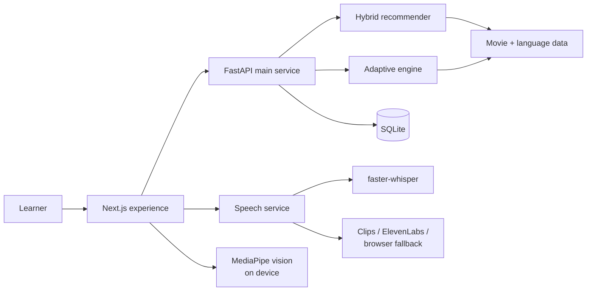

<div align="center">

# 🎬 CINEMIX

### Level up your English, one scene at a time.

An adaptive movie-discovery and language-learning experience that turns the films you love into a personalized English journey.

[](https://cinemix-murex.vercel.app/)
[](https://nextjs.org/)
[](https://fastapi.tiangolo.com/)
[](https://www.python.org/)

[Try Cinemix](https://cinemix-murex.vercel.app/) · [Explore the architecture](#-architecture) · [Run locally](#-local-development) · [Deploy](DEPLOYMENT.md)

</div>

---

## The idea

Most language apps teach from a fixed curriculum. Cinemix starts somewhere more personal: **your taste in movies**.

It assesses your English, learns what you enjoy, and recommends a film that fits both. After watching, real subtitle vocabulary, contextual quizzes, pronunciation practice, and adaptive feedback turn entertainment into an active learning loop.

## ✨ The experience

| Chapter | What happens |
| --- | --- |
| **Discover your level** | A four-skill assessment builds an initial learner profile. |
| **Set your direction** | Choose a learning goal, favorite genres, and films you already love. |
| **Meet your match** | A hybrid recommender balances language difficulty with movie taste. |
| **Learn in context** | Study vocabulary and expressions drawn from real subtitle data. |
| **Practice speaking** | Listen to a reference line, record your take, and receive Whisper-powered feedback. |
| **Adapt and repeat** | Quiz and speaking results update the learner profile for the next activity. |

## 🌟 Highlights

- **Adaptive recommendations** — combines learner level, goals, genre preferences, and movie similarity.
- **Real language context** — vocabulary candidates and practice lines are prepared from subtitle data.
- **Speech feedback** — faster-whisper powers transcription and speaking analysis.
- **Resilient reference audio** — uses project-owned clips first, ElevenLabs when configured, and browser speech synthesis as a fallback.
- **Privacy-minded vision** — MediaPipe evaluates face visibility and mouth movement locally in the browser; camera video is not uploaded.
- **Cinematic interface** — an animated, scene-based journey built with Framer Motion, GSAP, and Tailwind CSS.
- **Persistent progress** — Zustand keeps the experience state available across browser sessions.

## 🏗 Architecture



| Layer | Technology |
| --- | --- |
| Frontend | Next.js 16, React 19, TypeScript, Tailwind CSS 4 |
| Motion & state | Framer Motion, GSAP, Zustand |
| Browser vision | MediaPipe Tasks Vision |
| Main API | FastAPI, SQLite, pandas, scikit-learn, spaCy, Gensim |
| Speech service | faster-whisper, CTranslate2, ElevenLabs |
| Production | Vercel frontend + two Railway services |

## 🚀 Local development

### Prerequisites

- Node.js **20.9+**
- Python **3.12**
- npm

### 1. Clone and configure

```bash
git clone https://github.com/ranatsa9/Cinemix.git
cd Cinemix
cp .env.example .env.local
```

Replace the example service URLs in `.env.local` with:

```env
NEXT_PUBLIC_API_URL=http://127.0.0.1:8000
NEXT_PUBLIC_SPEECH_API_URL=http://127.0.0.1:8001
```

### 2. Start the main API

```bash
python -m venv .venv
source .venv/bin/activate
pip install -r backend/requirements-main.txt
python -m spacy download en_core_web_md
uvicorn backend.main:app --host 127.0.0.1 --port 8000
```

The API is available at `http://127.0.0.1:8000`; interactive docs are at `http://127.0.0.1:8000/docs`.

### 3. Start the frontend

In a second terminal:

```bash
npm install
npm run dev
```

Open [http://localhost:3000](http://localhost:3000).

### 4. Start the speech service (optional)

Speaking transcription runs as a separate service. In a third terminal:

```bash
python -m venv .venv-speech
source .venv-speech/bin/activate
pip install -r backend/requirements-speech.txt
PORT=8001 python -m backend.Speech_TTS_Backend
```

Add `ELEVENLABS_API_KEY` and `ELEVENLABS_VOICE_ID` to `backend/.env` if you want ElevenLabs reference audio. Never commit real credentials. Without ElevenLabs, Cinemix can fall back to browser speech synthesis.

> [!NOTE]
> Camera and microphone access are only needed for the speaking activity. The Whisper model downloads on the first transcription request, so the first attempt may take longer.

## 📁 Project structure

```text
Cinemix/
├── src/
│   ├── app/                 # Next.js routes and global styles
│   ├── components/scenes/   # The cinematic learning journey
│   └── lib/                 # API client, state, services, vision, and data
├── backend/
│   ├── adaptive/            # Learner model and adaptation engine
│   ├── data/                # Movie, vocabulary, and practice datasets
│   ├── routers/             # FastAPI endpoints
│   ├── main.py              # Main API entry point
│   └── Speech_TTS_Backend.py
├── public/movies/           # Poster, backdrop, and ambient artwork
├── Dockerfile.api
├── Dockerfile.speech
└── DEPLOYMENT.md
```

## ☁️ Deployment

Cinemix is designed as three independently deployable services:

1. **Vercel** — Next.js frontend
2. **Railway** — main FastAPI service via `Dockerfile.api`
3. **Railway** — speech service via `Dockerfile.speech`

See the [deployment guide](DEPLOYMENT.md) for environment variables, health checks, Docker configuration, and a production smoke-test checklist.

## 🔐 Privacy & secrets

- Camera analysis stays in the browser; no camera frames are sent to the backend.
- ElevenLabs credentials belong only in the speech service environment.
- Never put secrets in a `NEXT_PUBLIC_*` variable or commit a real `.env` file.
- Public speech routes do not expose backend files.

## 👥 Team

Built by [Maram Alzahrani](https://www.linkedin.com/in/maram-alzahrani314), [Yasser Alghamedi](https://www.linkedin.com/in/yasir-data), [Rana Aljuaid](https://www.linkedin.com/in/rana-aljuaid-494374363), [Yasser Alqulayti](https://www.linkedin.com/in/yasser-alqulayti-0b7609386), and [Sumaya Alsuhimi](https://www.linkedin.com/in/sumaya-alsuhimi).

Project materials are available in the [shared Google Drive folder](https://drive.google.com/drive/folders/13OXh9sDsF7TOkBP7OdiQohPV-Dzxi1sY).

---

<div align="center">

**Your next lesson might already be your favorite movie.**

[Launch Cinemix](https://cinemix-murex.vercel.app/)

</div>
